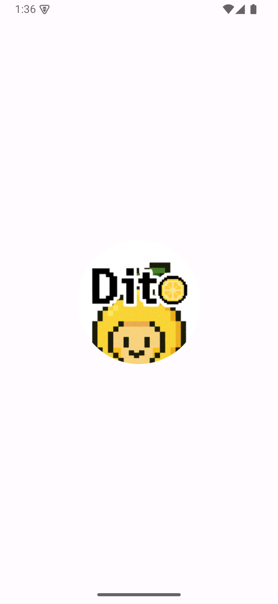
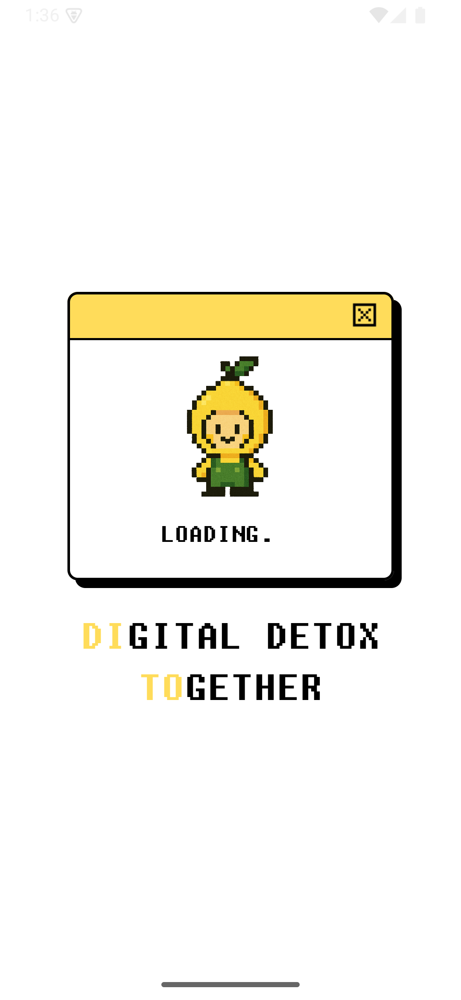
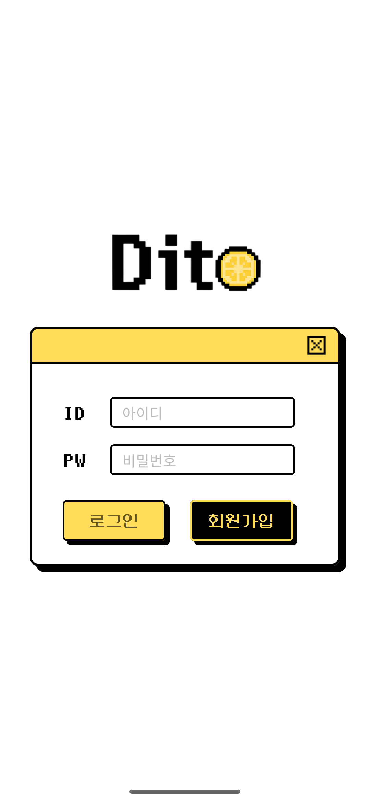
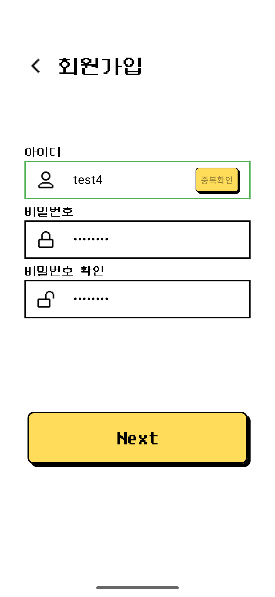
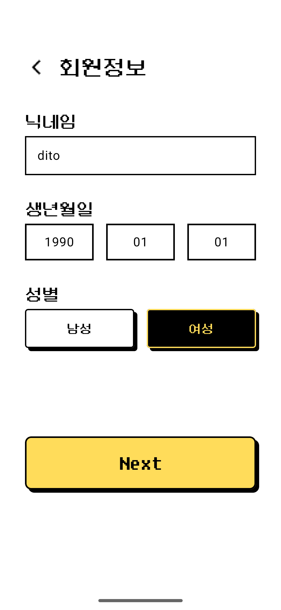
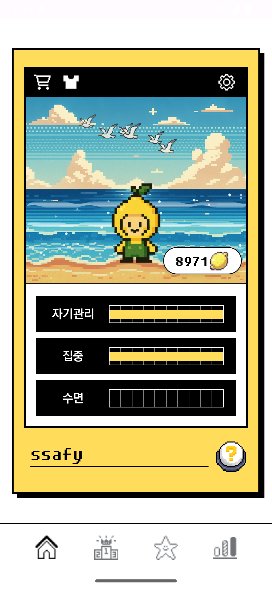

# DITO (Digital Detox)

삼성 청년 SW아카데미(SSAFY) 13th 자율 프로젝트

## 프로젝트 진행 기간

2025.10.10 ~ 2025.11.20 (6주)

## 프로젝트 소개

### 서비스 한줄 소개

**AI 기반 디지털 디톡스 플랫폼으로 스마트폰 과의존을 줄이고 건강한 디지털 습관을 만들어가는 서비스**

"당신의 디지털 라이프를 더 건강하게, DITO와 함께"

### 기획 배경

현대인들은 하루 평균 4~6시간 이상 스마트폰을 사용하며, 디지털 기기 과의존은 이미 사회적 문제로 대두되고 있습니다. 특히 YouTube 같은 짧은 영상 콘텐츠의 확산으로 무의식적인 스크롤링과 시간 낭비가 증가하고 있습니다.

저희가 해결하고자 한 문제점들:

- **무의식적 스마트폰 사용**: 습관적으로 앱을 열고 시간을 낭비하는 패턴
- **실시간 개입 부재**: 기존 스크린 타임 앱은 사후 통계만 제공하고 실시간 개입 기능이 없음
- **동기부여 부족**: 혼자 하는 디지털 디톡스는 지속하기 어려움
- **개인화된 솔루션 부재**: 사용자별 라이프스타일과 패턴을 고려한 맞춤형 개입이 필요

### 프로젝트 설명 및 목표

DITO는 AI 기반 실시간 행동 분석과 개입을 통해 사용자의 디지털 습관을 개선하는 종합 디지털 웰빙 플랫폼입니다:

**핵심 기능:**

1. **실시간 앱 사용량 추적**: Android Accessibility Service를 활용한 정밀한 사용 패턴 모니터링
2. **AI 기반 실시간 개입 (Intervention)**: 과도한 앱 사용 감지 시 AI가 상황에 맞는 휴식/명상 미션 제안
3. **YouTube 영상 자동 분류**: MediaPipe 기반으로 시청 중인 영상의 카테고리를 자동 분석 (교육, 엔터테인먼트 등)
4. **AI 생성 일일 리포트**: 수면 패턴, 집중력, 자기조절 능력을 분석하여 개인화된 인사이트와 조언 제공
5. **그룹 챌린지**: 친구들과 함께 스크린 타임 감소 경쟁으로 동기부여 강화
6. **게임화 시스템**: 미션 완료 시 코인 획득, 아이템 수집으로 재미있는 디지털 디톡스 경험
7. **Wear OS 연동**: 스마트워치에서 호흡 운동 미션 수행 가능

## 멤버 소개

| 역할 | 이름 | 담당 업무 |
|------|------|----------|
| **팀장/Android** | 유지은 | 7주 일정 관리, 6명 팀원 태스크 분배, 기술 스택 선정(Android/Spring Boot/Realm/MongoDB 등), 시스템 아키텍처 설계 및 API 명세 조율, Spring Boot + MongoDB + Realm 구성 설계, OS 레벨 모니터링 시스템(AccessibilityService, MediaSessionListenerService, UsageStatsManager), 실시간 AI 개입 시스템 구축(AI 호출 로직 구현 및 쿨다운 고도화), 데이터 관리(로컬 Realm DB, WorkManager 배치 전송, 콘텐츠 분석), 그룹 챌린지 실시간 동기화(실시간 추월, 실사용 앱 공유, 챌린지 타겟앱 시간 누적) |
| **Android** | 박효정 | Jetpck Compose 기반 UI 개발 전반(Splash, Signup, Login, Home, Closet, Shop, ShopConfirm, MissionNotification), 자체 디자인 시스템 구축, 인터랙티브 애니메이션 및 사운드 피드백 구현, API 연동 및 ViewModel + Repository 기반 상태관리, Shop/Closet 무한 스크롤 페이지네이션 구현, 캐릭터 의상/배경 UI 개발 및 구매 플로우 구성, Pixel Art 스타일에 맞춘 컴포넌트/레이아웃 최적화.  |
| **Backend** | 위지훈 | 백엔드 구조 설계 및 미션, 유저, 상점, 유저 상태, 인증/인가 관련 API 개발
| **Backend/Infra** |  Backend API 개발, Android/Wear OS 앱 구현, 인프라 구축까지 전 영역을 담당. Spring Boot 기반 그룹 챌린지 시스템과 스크린타임 동기화 기능을 설계 및 구현. Health Connect SDK 연동과 Jetpack Compose 기반 UI 개발을 통해 사용자 경험을 구현했습니다. Jenkins CI/CD 파이프라인과 Docker Compose 멀티 컨테이너 환경을 구축하여 무중단 배포 체계를 확립. 푸시알림에 따른 워치앱 연동 및 실행 구현 |
| **Android** | 정윤영 | FE 그룹 및 설정 화면 개발, JetpackCompose 기반 UI 개발 : 공통 UI 컴포넌트 분리, 디자인 시스템 구축 및 적용 : Figma 스타일을 Compose 디자인 토큰으로 정리, Retrofit 기반 그룹 및 설정 API 연동 및 호출 최소화 |
| **AI** | 허민권 | LangGraph 기반 멀티 에이전트 오케스트레이션 아키텍처 설계(조정자 에이전트 + 4개 전문 에이전트 구조), ReAct 패턴 사고-행동-관찰 루프 구현, StateGraph와 Persistent Checkpoint를 활용한 에이전트 간 컨텍스트 보존 및 순환 그래프·조건부 분기 시스템 구축, ngnix 인프라 구축 및 파일서버 설계, 앱, 서버간 fcm 연동, 비동기 호출 및 알림 구현 |

## 기술 스택

### 협업 도구

- **Jira** – 이슈 트래킹 & 프로젝트 관리
- **GitLab** – Git 리포지토리 · CI/CD
- **Figma** – UI/UX 디자인 협업
- **Notion** – 문서화 및 회의록 관리

### Android (Mobile + Wear OS)

- **Kotlin** – 주 개발 언어
- **Jetpack Compose** – 선언형 UI 프레임워크
- **Hilt** – 의존성 주입 (Dependency Injection)
- **Realm** – 로컬 데이터베이스
- **Retrofit + OkHttp** – REST API 통신
- **WorkManager** – 백그라운드 작업 스케줄링
- **Firebase FCM** – 푸시 알림
- **Health Connect API** – 건강 데이터 통합
- **Accessibility Service** – 앱 사용량 추적
- **Coil** – 이미지 로딩
- **Lottie** – 애니메이션
- **ExoPlayer** – 미디어 재생

### Backend (Spring Boot)

- **Java 21** – 주 개발 언어
- **Spring Boot 3.5.7** – 웹 애플리케이션 프레임워크
- **Spring Security** – OAuth2 + JWT 기반 인증/인가
- **Spring Data JPA** – ORM (Hibernate)
- **Spring Data MongoDB** – NoSQL 문서 저장소
- **QueryDSL** – 타입 안전 쿼리 빌더
- **PostgreSQL** – 관계형 데이터베이스 (사용자, 미션, 그룹 등)
- **MongoDB** – 비정형 로그 데이터 (앱 사용 이벤트, 미디어 세션)
- **Redis** – 캐싱 및 분산 락
- **Flyway** – 데이터베이스 마이그레이션
- **Firebase Admin SDK** – FCM 서버 연동
- **SpringDoc OpenAPI** – Swagger API 문서화
- **Apache HttpClient 5** – HTTP 클라이언트

### AI Server (Python)

- **Python 3.12** – 주 개발 언어
- **LangGraph** – AI Agent 상태 머신 프레임워크
- **LangChain** – LLM 애플리케이션 프레임워크
- **Anthropic Claude** – LLM (Sonnet 4.5, Haiku 4.5)
- **FastAPI** – 고성능 비동기 웹 프레임워크
- **Redis** – 분산 락 (동시성 제어)
- **PostgreSQL** – LangGraph 상태 저장소
- **HTTPX** – 비동기 HTTP 클라이언트
- **Docker** – 컨테이너화

### Cloud / Infra

- **Docker Compose** – 컨테이너 오케스트레이션
- **Amazon EC2** – 클라우드 컴퓨팅
- **Nginx** – 리버스 프록시, 정적 파일 서빙
- **Jenkins** - CI/CD 자동화

## 시스템 아키텍처

```
┌──────────────────────────────────────────────────────────────┐
│                     Android Mobile App                       │
│                    (Kotlin + Compose)                        │
│  ┌────────────────────────────────────────────────────────┐  │
│  │ Accessibility Service (App Usage Tracking)             │  │
│  │ WorkManager (Background Sync: 30min batch, 15min sync) │  │
│  │ Firebase FCM (Push Notifications)                      │  │
│  │ Realm (Local Database)                                 │  │
│  └────────────────────────────────────────────────────────┘  │
└───────────────────┬──────────────────────────────────────────┘
                    │ HTTPS/REST API
        ┌───────────▼──────────────────────────────────────┐
        │         Spring Boot Backend (Java 21)            │
        │  ┌──────────────────────────────────────────┐    │
        │  │ Spring Security (OAuth2 + JWT)           │    │
        │  │ REST API (User, Mission, Report, Group)  │    │
        │  │ PostgreSQL (Relational Data)             │    │
        │  │ MongoDB (Event Logs: App/Media Usage)    │    │
        │  │ Redis (Caching, LiveKit Tokens)          │    │
        │  │ Firebase Admin SDK (FCM)                 │    │
        │  └──────────────────────────────────────────┘    │
        └───────────┬──────────────────────────────────────┘
                    │ Internal API (X-API-Key)
        ┌───────────▼─────────────────────────────────────┐
        │       AI Agent Server (Python 3.12)             │
        │  ┌──────────────────────────────────────────┐   │
        │  │ LangGraph Agents:                        │   │
        │  │  - Intervention Agent (실시간 개입)        │   │
        │  │  - Report Agent (일일 리포트)              │   │
        │  │  - Evaluation Agent (미션 효과성 측정)     │   │
        │  │  - YouTube Agent (영상 분류)              │   │
        │  │                                          │   │
        │  │ Anthropic Claude (Sonnet 4.5)            │   │
        │  │ Redis (Distributed Locks)                │   │
        │  │ PostgreSQL (State Persistence)           │   │
        │  └──────────────────────────────────────────┘   │
        └─────────────────────────────────────────────────┘

┌──────────────────────────────────────────────────────────────┐
│                     Wear OS Companion                        │
│  - Breathing Exercises (호흡 운동)                            │
│  - Mission Notifications (미션 알림)                          │
│  - Phone-Watch Sync (Wearable Data Layer)                    │
└──────────────────────────────────────────────────────────────┘
```

## ERD (Entity Relationship Diagram)

### 주요 엔티티

**User (사용자)**
- personalId (PK) - 고유 식별자
- nickname - 닉네임
- birth - 생년월일
- gender - 성별
- job - 직업
- coinBalance - 보유 코인
- frequency - 개입 빈도 설정
- fcmToken - Firebase 푸시 토큰

**Mission (미션)**
- missionId (PK)
- userId (FK) - 사용자
- missionType - 미션 타입 (REST, MEDITATION)
- missionText - 미션 내용
- coinReward - 보상 코인
- durationSeconds - 미션 수행 시간
- targetApp - 타겟 앱
- status - 상태 (IN_PROGRESS, SUCCESS, FAIL)
- sleepChange, focusChange, selfCareChange - 스탯 변화

**GroupChallenge (그룹 챌린지)**
- groupId (PK)
- groupName - 그룹 이름
- inviteCode - 초대 코드
- period - 기간 타입 (DAILY, WEEKLY)
- startDate, endDate - 시작/종료 날짜
- goalDescription - 목표 설명
- totalBetCoins - 총 베팅 코인
- status - 상태 (ACTIVE, COMPLETED, CANCELLED)

**Report (일일 리포트)**
- reportId (PK)
- userId (FK)
- reportDate - 리포트 날짜
- overview - AI 생성 전체 요약
- advice - AI 생성 조언
- sleepScore, focusScore, selfCareScore - 각 영역별 점수
- status - 상태 (IN_PROGRESS, COMPLETED)

**AppUsageEvent (MongoDB - 앱 사용 로그)**
- eventId
- personalId
- appPackageName
- appName
- startTime, endTime
- durationMillis

**Item (아이템)**
- itemId (PK)
- itemName - 아이템 이름
- itemType - 아이템 타입
- price - 가격
- imageUrl - 이미지 URL

## 프로젝트 구조

### Backend (Spring Boot)

```
backend/Dito/src/main/java/com/ssafy/Dito/
├── global/                       # 글로벌 설정
│   ├── config/                  # Redis, Security 등
│   └── environment/             # 외부 프로퍼티
└── domain/                      # 도메인별 패키지
    ├── ai/                      # AI 서버 연동
    │   ├── api/                # AI 서버 API 호출
    │   ├── evaluation/         # 미션 효과성 평가
    │   ├── intervention/       # 실시간 개입
    │   └── report/             # 일일 리포트
    ├── auth/                    # 인증 (로그인/회원가입)
    ├── fcm/                     # Firebase 푸시 알림
    ├── groups/                  # 그룹 챌린지
    │   ├── entity/
    │   ├── repository/
    │   ├── service/
    │   └── controller/
    ├── item/                    # 상점 아이템
    ├── log/                     # 사용 로그
    │   ├── appUsageEvent/      # 앱 사용 이벤트 (MongoDB)
    │   └── mediaSessionEvent/  # 미디어 세션 이벤트 (MongoDB)
    ├── mission/                 # 미션 시스템
    ├── missionResult/          # 미션 결과
    ├── report/                  # 일일/주간 리포트
    ├── screentime/             # 스크린 타임 추적
    ├── status/                  # 사용자 스탯 (수면, 집중, 자기조절)
    ├── user/                    # 사용자 관리
    └── weaklyGoal/             # 주간 목표
```

### Android (Kotlin)
```
android/app/src/main/java/com/dito/app/
├── core/                         # 핵심 기능
│   ├── background/              # WorkManager 백그라운드 작업
│   │   ├── EventSyncWorker.kt          # 30분 주기 이벤트 배치 동기화
│   │   ├── ScreenTimeSyncWorker.kt     # 15분 주기 스크린 타임 동기화
│   │   └── MissionEvaluationWorker.kt  # 미션 완료 평가
│   ├── data/                    # 데이터 모델
│   │   ├── dto/                # 서버 통신 DTO
│   │   └── entity/             # Realm 엔티티
│   ├── di/                      # Hilt 의존성 주입
│   ├── fcm/                     # Firebase 푸시 알림
│   ├── navigation/              # Compose Navigation
│   ├── network/                 # API 서비스
│   │   ├── BackendApi.kt       # 백엔드 API
│   │   └── AiApi.kt            # AI 서버 API
│   ├── notification/            # 알림 관리
│   ├── repository/              # 데이터 저장소
│   ├── service/                 # Android Service
│   │   ├── AppMonitoringService.kt     # 앱 사용 추적 (Accessibility)
│   │   ├── InterventionService.kt      # 실시간 개입
│   │   └── MissionService.kt           # 미션 관리
│   ├── storage/                 # SharedPreferences
│   ├── ui/                      # 공통 UI 컴포넌트
│   ├── util/                    # 유틸리티
│   └── wearable/                # Wear OS 통신
├── data/                        # 데이터 레이어
├── domain/                      # 도메인 레이어
└── feature/                     # 기능별 모듈
    ├── auth/                    # 로그인/회원가입
    ├── closet/                  # 아이템 수집
    ├── group/                   # 그룹 챌린지
    ├── health/                  # Health Connect 연동
    ├── home/                    # 홈 대시보드
    ├── intervention/            # 개입 알림
    ├── missionNotification/    # 미션 알림
    ├── report/                  # 리포트 조회
    ├── settings/                # 설정
    ├── shop/                    # 상점
    └── splash/                  # 스플래시 화면
```

### AI Server (Python)

```
ai/
├── src/agent/                   # AI 에이전트
│   ├── intervention_agent.py   # 실시간 행동 개입 에이전트
│   ├── evaluation_agent.py     # 미션 효과성 평가 에이전트
│   ├── report_agent.py         # 일일 리포트 생성 에이전트
│   ├── youtube_agent.py        # YouTube 영상 분류 에이전트
│   ├── debug_agent.py          # 디버깅용 에이전트
│   ├── prompts.py              # LLM 프롬프트
│   ├── schemas.py              # Pydantic 모델, TypedDict
│   ├── utils.py                # LLM 설정, 유틸리티
│   ├── lock_manager.py         # Redis 분산 락
│   └── eval/                   # 평가 데이터셋
│       ├── intervention_dataset.py
│       ├── evaluate_intervention.py
│       └── *.jsonl            # 테스트 케이스
├── tests/                       # Pytest 테스트
├── docker-compose.yml          # Redis + PostgreSQL + LangGraph
├── langgraph.json              # LangGraph 서버 설정
├── pyproject.toml              # Python 의존성
└── Makefile                    # 개발 명령어
```

## 주요 기능 소개

### 01. 스플래시 & 로그인





**로그인 방식:**



- 자체 로그인
- JWT 기반 토큰 인증 (Access Token + Refresh Token)

**회원가입 시 입력 정보:**




- 닉네임, 생년월일, 성별, 직업
- 개입 빈도 설정 (RARELY, NORMAL, OFTEN)

### 02. 홈 대시보드 

**표시 정보:**



- 오늘 스크린 타임 (실시간 업데이트)
- 현재 스탯 (수면, 집중력, 자기조절)
- 보유 코인
- 진행 중인 미션
- 활성화된 그룹 챌린지
- 최근 리포트

**주요 액션:**


- 상점
- 리포트 보기
- 그룹 챌린지 참여
- 상점 방문
- 설정 이동

### 03. 실시간 앱 사용량 추적

**기술 구현:**
- Android Accessibility Service를 통한 포그라운드 앱 감지
- 1초마다 현재 실행 중인 앱 체크
- Realm 로컬 DB에 세션별 저장
- WorkManager로 30분마다 서버에 배치 동기화

**추적 데이터:**
- 앱 패키지명, 앱 이름
- 시작/종료 시간, 사용 시간
- YouTube 영상 URL (MediaSession API)
- 전환 횟수 (앱 스위칭)

### 04. AI 기반 실시간 개입

**동작 원리:**

1. **과도한 사용 감지**
   - Android 앱에서 특정 앱 (예: YouTube, 게임) 장시간 사용 감지
   - 백엔드 API 호출: `POST /api/ai/intervention`

2. **AI 분석 (LangGraph Intervention Agent)**
   ```
   ① Redis 락 획득 (중복 개입 방지, 60초 TTL)
   ② YouTube 영상 분류 (YouTube Agent 호출)
      - 영상 타입: EDUCATIONAL, ENTERTAINMENT, SHORT_FORM 등
      - 키워드: TECH, FOOD, GAMING 등
   ③ 행동 패턴 분석 (LLM)
      - 시간대 (새벽/오전/오후/저녁)
      - 심각도 점수 (0.0-1.0)
      - 최근 미션 이력
   ④ 개입 필요성 판단 (LLM)
      - 개입이 필요한지 여부 결정
   ⑤ 미션 생성 (LLM)
      - 미션 타입: REST (휴식) or MEDITATION (명상)
      - 미션 시간: 10~300초
      - 보상 코인: 10~50
   ⑥ 넛지 메시지 생성 (LLM)
      - 친근하고 공감적인 톤
      - 개인화된 메시지
   ⑦ FCM 푸시 알림 전송
   ⑧ Redis 락 해제
   ```

3. **사용자 응답**
   - 알림 클릭 시 미션 수행 화면 이동
   - 미션 완료 시 코인 획득 + 스탯 증가
   - 미션 거부 시 기록만 저장

**넛지 메시지 예시:**
> "벌써 1시간째 YouTube를 보고 계시네요 👀
> 눈도 피로하고 집중력도 떨어질 시간이에요.
> 3분간 눈을 감고 휴식하면서 재충전해볼까요? 💙"

### 05. YouTube 영상 자동 분류

**분류 카테고리:**
- EDUCATIONAL (교육)
- ENTERTAINMENT (엔터테인먼트)
- NEWS_INFO (뉴스/정보)
- VLOG (브이로그)
- SHORT_FORM (쇼츠)
- GAMING (게임)
- MUSIC (음악)
- REVIEW (리뷰)
- TUTORIAL (튜토리얼)
- UNKNOWN (미분류)

**키워드 태그:**
- HISTORY, SCIENCE, TECH, FOOD, TRAVEL, HEALTH 등 20+ 키워드

**활용:**
- AI 개입 시 영상 타입에 따른 차별화된 메시지
- 리포트에서 시청 패턴 분석
- 교육 영상 시청 시 긍정적 피드백

### 06. AI 생성 일일 리포트

**리포트 생성 시점:**
- 매일 자정 (00:00) 자동 생성
- 사용자가 수동으로 요청 가능

**분석 항목:**

1. **수면 패턴 (Sleep)**
   - 밤 10시~새벽 6시 사이 앱 사용량
   - 점수: LOW (좋음), MEDIUM (보통), HIGH (나쁨)
   - 인사이트 예시: "어젯밤 자정 이후에도 YouTube를 1시간 시청했어요"

2. **집중력 (Focus)**
   - 앱 전환 횟수, 총 사용 시간
   - 점수: LOW (산만함), MEDIUM, HIGH (집중함)
   - 인사이트 예시: "오늘 앱을 50번이나 전환했어요. 멀티태스킹을 줄여보세요"

3. **자기조절 (Self-Care)**
   - 미션 성공률
   - 점수: LOW (낮음), MEDIUM, HIGH (높음)
   - 인사이트 예시: "오늘 3개의 미션 중 2개를 완료했어요!

**AI 생성 콘텐츠:**
- **전체 요약 (Overview)**: 하루 전체를 아우르는 종합 평가
- **조언 (Advice)**: 개인화된 행동 개선 제안 (친근한 톤)

**리포트 조회:**
- 홈 화면에서 최근 리포트 확인
- 리포트 상세 페이지에서 전체 내용 열람
- 과거 리포트 히스토리 조회

### 07. 그룹 챌린지

**챌린지 생성:**
- 방장이 그룹 이름, 기간, 목표, 베팅 코인 설정
- 초대 코드 자동 생성 (6자리)
- 최대 인원 제한 없음

**참여:**
- 초대 코드 입력으로 참여
- 베팅 코인 차감 (참여 시점)
- 그룹 멤버 리스트 확인

**랭킹 시스템:**
- 실시간 스크린 타임 기준 순위
- 15분마다 WorkManager로 스크린 타임 동기화
- 일일 랭킹, 주간 랭킹

**보상:**
- 챌린지 종료 시 1등에게 총 베팅 코인의 50%
- 2등 30%, 3등 20%
- 나머지 참가자는 참가 코인 환불

### 08. 미션 시스템

**미션 타입:**

1. **REST (휴식)**
   - 스마트폰을 내려놓고 쉬기
   - 타이머 종료 시까지 앱 사용 금지
   - Wear OS에서 타이머 확인 가능

2. **MEDITATION (명상)**
   - Wear OS 호흡 운동 앱 실행
   - 가이드에 따라 심호흡
   - 심박수 모니터링 (Health Connect)

**미션 흐름:**
```
AI 개입 → 미션 생성 → FCM 알림 → 사용자 수락
→ 미션 수행 → 완료/실패 → 보상 지급/차감 → 스탯 변경
```

**보상:**
- 성공 시: 코인 획득 + 스탯 증가
- 실패 시: 코인 차감 + 스탯 감소

### 09. 게임화 시스템

**코인 획득 방법:**
- 미션 완료 (10~50 코인)
- 일일 출석 (10 코인)
- 그룹 챌린지 우승 (100~500 코인)

**코인 사용:**
- 상점에서 아이템 구매
- 그룹 챌린지 베팅

**스탯 시스템:**
- **수면 (Sleep)**: 0~100점
- **집중력 (Focus)**: 0~100점
- **자기조절 (Self-Care)**: 0~100점
- 미션 완료/실패에 따라 증감

**아이템:**
- 프로필 아이콘, 배경, 뱃지 등 (추후 구현 예정)

### 10. Wear OS 연동

**주요 기능:**

1. **호흡 운동 (Breathing Activity)**
   - 명상 미션 수행 시 자동 실행
   - 애니메이션 가이드 (흡입 4초, 호흡 4초)
   - 진동 피드백

2. **미션 알림 수신**
   - 폰에서 받은 FCM 알림을 워치에도 표시
   - 워치에서 바로 미션 시작 가능

3. **폰-워치 동기화**
   - Wearable Data Layer로 실시간 상태 동기화
   - 미션 진행 상황 공유

### 11. 설정

**사용자 설정:**
- 개입 빈도 조정 (RARELY, NORMAL, OFTEN)
- 알림 설정 (개입, 미션, 리포트, 그룹)
- 계정 정보 수정

**접근성 권한:**
- Accessibility Service 활성화 안내
- 알림 권한 요청
- Health Connect 연동 권한

## 기술적 세부 사항

### 실시간 통신 최적화

**백그라운드 동기화 전략:**
- **EventSyncWorker (30분 주기)**: 앱 사용 이벤트, 미디어 세션 배치 전송
- **ScreenTimeSyncWorker (15분 주기)**: 그룹 챌린지용 스크린 타임 실시간 동기화
- **MissionEvaluationWorker (미션 종료 시)**: 미션 완료 여부 평가 및 보상 처리

**네트워크 효율성:**
- Retrofit + OkHttp 인터셉터로 자동 재시도
- 배치 전송으로 API 호출 횟수 최소화
- WiFi 연결 시 우선 동기화

### AI Agent 아키텍처

**LangGraph 상태 머신:**
```python
# Intervention Agent 예시
class InterventionState(TypedDict):
    user_id: str
    app_name: str
    youtube_url: Optional[str]
    usage_duration: int
    intervention_needed: bool
    mission_type: Optional[str]
    nudge_message: Optional[str]

workflow = StateGraph(InterventionState)
workflow.add_node("youtube_analysis", analyze_youtube)
workflow.add_node("pattern_analysis", analyze_pattern)
workflow.add_node("decision", decide_intervention)
workflow.add_node("mission_generation", generate_mission)
workflow.add_node("nudge_creation", create_nudge)
workflow.add_node("send_notification", send_fcm)
```

**동시성 제어:**
- Redis 분산 락으로 동일 사용자 중복 개입 방지
- 락 TTL 60초로 데드락 방지
- 락 획득 실패 시 즉시 반환

**LLM 최적화:**
- 간단한 작업은 Haiku 4.5 (빠르고 저렴)
- 복잡한 분석은 Sonnet 4.5 (정확도 우선)
- 프롬프트 캐싱으로 비용 절감

### 데이터베이스 전략

**PostgreSQL (관계형 데이터):**
- 사용자, 미션, 그룹, 리포트 등 정형 데이터
- JPA + QueryDSL로 복잡한 조인 쿼리 최적화
- Flyway로 스키마 버전 관리

**MongoDB (비정형 로그):**
- AppUsageEvent, MediaSessionEvent 등 대용량 이벤트
- 시계열 데이터 저장 최적화
- 인덱싱으로 빠른 조회

**Realm (로컬 DB):**
- Android 앱 내 오프라인 데이터 저장
- 반응형 쿼리로 UI 자동 업데이트
- 백그라운드 스레드에서 안전한 쓰기

**Redis (캐싱):**
- JWT 토큰 블랙리스트
- AI Agent 분산 락
- 세션 데이터 임시 저장

### 보안

**인증/인가:**
- OAuth2 소셜 로그인 (Google, Kakao)
- JWT Access Token (15분 유효)
- JWT Refresh Token (7일 유효)
- Spring Security Filter Chain

**API 보안:**
- 백엔드 ↔ AI 서버: `X-API-Key` 헤더 검증
- HTTPS 통신 (TLS 1.3)
- CORS 설정

**데이터 보호:**
- Accessibility Service 데이터는 암호화 저장
- FCM 토큰 서버 측 관리
- 민감 정보 로그 제외

## 성능 최적화

### Android 최적화

**Compose 성능:**
- `remember`, `derivedStateOf`로 불필요한 리컴포지션 방지
- `LazyColumn`으로 긴 리스트 렌더링
- 이미지 로딩 최적화 (Coil + 메모리 캐시)

**배터리 절약:**
- WorkManager Periodic Worker로 배터리 효율적인 스케줄링
- Doze 모드 대응 (백그라운드 작업 최소화)
- Foreground Service 사용 최소화

### Backend 최적화

**쿼리 최적화:**
- N+1 문제 해결 (Fetch Join)
- QueryDSL로 동적 쿼리 최적화
- 인덱싱으로 조회 속도 향상

**캐싱:**
- Redis로 자주 조회되는 데이터 캐싱
- Spring Cache Abstraction 활용

### AI 최적화

**응답 시간 단축:**
- YouTube 분류와 패턴 분석 병렬 처리
- 프롬프트 최적화로 토큰 수 감소
- Streaming 응답 (추후 적용 예정)

## 프로젝트 후기

### [팀장/Android] 유지은
Android 개발 경험이 거의 없는 상태에서 프로젝트를 시작했지만, AccessibilityService와 MediaSession 같은 OS 레벨 기능들을 직접 다루며 Android 플랫폼 전반에 대한 이해도를 크게 확장할 수 있었습니다. 특히 “로컬 90% + AI 10%”라는 구조를 실제로 구현하는 과정이 의미 있었습니다. 0.1초 단위로 발생하는 이벤트를 모두 서버로 보낼 수 없기 때문에 ThresholdChecker로 1차 필터링을 수행하고, 애매한 일부 이벤트만 AI에 전달하는 방식으로 설계해 3초 이내 실시간 개입과 운영 비용 절감을 동시에 달성했습니다.

YouTube 탐지 구조도 큰 도전이었습니다. MediaSession에서 영상 정보를 제공하지 않아, AccessibilityService로 UI 트리를 직접 파싱하는 3단계 fallback 전략을 도입했고, 이후 Premium 기반 감지가 가능해지기까지 많은 시행착오를 거치며 Android의 보안 정책과 UI 구조를 깊이 이해할 수 있었습니다. 재생/탐색 과정에서 발생하는 중복 호출 문제는 PlaybackProbe와 독립 쿨다운 구조를 설계해 해결하며 사용자 경험과 시스템 안정성을 모두 고려할 수 있었습니다.

그룹 챌린지 영역에서는 YouTube 시청 시 30초 단위의 자동 스크린타임 동기화와 사용자별 앱 사용 현황 실시간 표시 기능을 구현했습니다. 또한 교육 콘텐츠를 자동으로 감지해 챌린지 집계에서 제외하는 로직을 만들며 ‘스마트폰 사용의 맥락’을 기술적으로 구분하는 경험을 할 수 있었습니다.

팀장으로서는 Clean Architecture, Hilt DI, Realm DB 등 핵심 구조를 초기에 명확하게 정의한 덕분에 Android–Backend–AI 세 파트가 독립적으로 작업하면서도 안정적으로 통합될 수 있었습니다. 실시간 이벤트 처리, Coroutine 기반 동시성 제어, FCM 기반 넛지 설계 등 다양한 기술을 실제 문제 해결에 적용하며 PM 및 개발자로서 성장할 수 있었던 프로젝트였습니다.

### [Android/Frontend] 박효정
디자인 시스템을 체계적으로 구축한 덕분에 안정된 Pixel Art 스타일을 유지하며 빠르게 개발할 수 있었습니다. Jetpack Compose의 Animation API를 활용해 레몬 폭죽 애니메이션 등 다양한 인터랙션을 구현하는 과정이 특히 즐거웠고, 자연스러운 효과를 만들기 위해 랜덤 값과 타이밍을 조절하며 많은 시행착오를 겪었습니다.
Kotlin은 처음이라 걱정이 컸지만, Figma 디자인을 최대한 정확하게 재현하는 것을 목표로 구현 디테일에 집중했습니다. 또한 ViewModel 기반으로 UI와 로직을 명확히 분리하면서 구조적 중요성을 다시 체감했고, API 설계나 DTO 구조에서도 책임 분리의 필요성을 배울 수 있었습니다. 단순 UI 개발을 넘어 ‘사용자가 느끼는 리듬과 감정’을 고려하게 된 의미 있는 프로젝트였습니다.

### [Backend] 위지훈
Dito 프로젝트를 진행하면서 초반에 프로젝트 구조와 개발 규칙을 체계적으로 정하고 시작한 점이 큰 도움이 되었습니다. 이러한 기반 덕분에 전체적인 코드 흐름이 흔들리지 않았고, 팀원 간 협업도 더욱 수월해졌습니다.
또한 이전부터 활용해보고 싶었던 QueryDSL을 실제로 적용하며, 사전에 정해둔 코드 규칙에 맞게 깔끔하게 코드를 작성할 수 있었던 점이 매우 만족스러웠습니다.

추가로, 서비스 사용 경험을 높이기 위해 이미지 로딩 속도를 어떻게 개선할지 고민하다가 캐싱 전략을 도입했습니다. 이미지 요청이 반복될 때마다 서버 부하가 쌓이는 문제를 줄이고, 사용자에게 더 빠른 응답을 제공하기 위해 캐싱을 적용했으며, 그 결과 체감 속도가 눈에 띄게 향상되는 효과를 얻을 수 있었습니다.

전반적으로 기술적 시도와 구조적 정리가 잘 맞물리며, 개발 역량을 한 단계 확장할 수 있었던 프로젝트였습니다.

### [Backend/Infra] 장아영
웹 개발으로는 할 수 없는 건강 데이터나 사용자의 실제 데이터를 활용하여 서비스에 적용하는 경험이 정말 의미 있었고, 워치앱 개발, 안드로이드 로그를 기반으로 사용 시간을 추출하는 경험 등 새로 해볼 수 있었던 것이 많아서 좋았습니다. 또한 모든 팀원분들이 새로운 기술과 프로젝트를 디벨롭하기 위한 고민들을 각자 하셔서 많이 배울 수 있었고, 제가 생각하기에도 스스로 많이 성장했다고 생각합니다.

### [Android/Frontend] 정윤영
Jetpack Compose 기반으로 전체 UI를 구현하며 디자인 시스템을 정의해 개발 속도와 일관성을 높였다.
웹과 다른 앱의 동작 특성을 고려해 안정적인 FE 구조를 설계했고, Retrofit + Coroutine 기반으로 API 호출을 최소화하는 데이터 흐름을 구축했다.
4명 그룹 챌린지에서는 동시성 문제와 Rank 변동을 고려해 ID 기반 diff 업데이트와 단일 상태 관리(StateFlow)로 안정적인 UI 동작을 구현했다.
이 과정을 통해 상태 기반 앱 개발, 실시간 UI 처리, API 최적화 같은 모바일 FE 핵심 기술을 체계적으로 경험할 수 있었다. 

### [AI] 허민권
이번 프로젝트는 단순 LLM API 호출이 아닌, 실제 동작하는 멀티 에이전트 시스템을 설계하고 운영해본 경험이었습니다.

에이전트 오케스트레이션

LangGraph로 조정자 에이전트와 4개의 전문 에이전트(패턴 인사이트, 콘텐츠 분석, 라이프 코치, 알림 매니저)를 구성했습니다. ReAct 패턴을 적용해 "생각-행동-관찰" 루프를 구현하니 추론 능력이 확실히 나아졌고, 상태 그래프로 체크포인트를 관리해 안정성도 확보할 수 있었습니다.

인프라 구축

Nginx로 정적 파일 서빙, 리버스 프록시, SSL 설정을 직접 처리했습니다. FCM 으로 실시간 행동 분석과 맥락 인식 알림 시스템을 만들면서, 비동기통신의 복잡함과 견고한 아키텍처의 중요성을 체감했습니다.

가장 어려웠던 점: 컨텍스트 vs 비용

에이전트 간 대화 컨텍스트 유지와 토큰 비용 최적화 사이의 균형이 가장 큰 고민이었습니다. 결국 단순한 판단은 룰 기반으로, 복잡한 분석만 LLM으로 처리하는 하이브리드 방식을 택했습니다. 덕분에 실시간 반응 속도와 비용 효율 둘 다 잡을 수 있었습니다.

배운 점

이론으로만 알던 AI 에이전트를 실제 서비스로 구현하는 전체 과정을 경험했습니다. 멀티 에이전트 시스템과 이를 지탱하는 인프라를 직접 만들면서 프로덕션 환경에 대한 실무 감각을 많이 쌓았습니다. 문제를 하나씩 해결하는 과정 자체가 값진 경험이었습니다.

## 향후 발전 방향

### 기술적 확장

- **AI 모델 고도화**: 사용자별 맞춤형 개입 전략 학습
- **실시간 스트리밍**: LLM Streaming으로 넛지 메시지 즉시 표시
- **멀티모달 AI**: 스크린샷 분석으로 더 정밀한 콘텐츠 분류
- **예측 모델**: 사용자의 중독성 행동 패턴 사전 예측

### 서비스 확장

- **iOS 앱 출시**: Swift + SwiftUI로 크로스 플랫폼 확장
- **웹 대시보드**: 부모/관리자용 통계 대시보드
- **기업 솔루션**: B2B 직원 웰빙 관리 프로그램
- **교육기관 연동**: 학생 디지털 리터러시 교육 도구

### 커뮤니티 기능

- **친구 시스템**: 친구 추가, 함께한 챌린지 히스토리
- **공개 챌린지**: 전국 단위 스크린 타임 감소 대회
- **성과 공유**: SNS 연동으로 성과 자랑하기
- **멘토링**: 디지털 디톡스 성공자가 초보자 도와주기

### 헬스케어 통합

- **수면 분석 강화**: Health Connect 수면 데이터와 연동
- **운동 권장**: 스크린 타임 대신 운동 미션 제안
- **정신 건강**: 스트레스, 불안 지수와 스마트폰 사용 상관관계 분석

## 문의

프로젝트 관련 문의사항은 아래 연락처로 부탁드립니다:

- **이메일**: jieun8764@gmail.com
---

**© 2025 DITO Team. All rights reserved.**

*삼성 청년 SW아카데미(SSAFY) 13기 자율 프로젝트*
